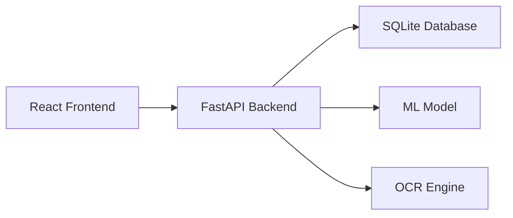
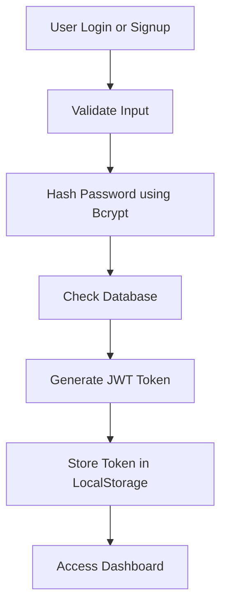
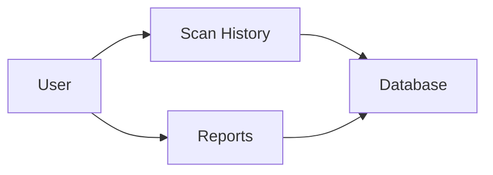
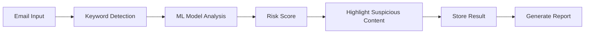
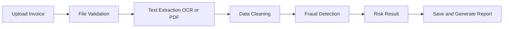

# 🛡️ CyberSaarthi - AI-Powered Phishing & Invoice Fraud Detection Platform

CyberSaarthi is a full-stack web application designed to help Indian MSMEs detect phishing emails and identify fraudulent invoices using AI-driven analysis and OCR-based intelligence.

---

## 🎯 Overview

CyberSaarthi helps users to:

* Detect phishing emails using ML + keyword analysis
* Analyze invoices using OCR and fraud detection rules
* Highlight suspicious content in real-time
* Maintain secure user-specific data using JWT authentication
* Provide bilingual support (English and Hindi)

---

## 📊 System Architecture


```mermaid
flowchart LR
    A[React Frontend] --> B[FastAPI Backend]
    B --> C[SQLite Database]
    B --> D[ML Model]
    B --> E[OCR Engine]
```

---

## 🔐 Authentication Flow


```mermaid
flowchart TD
    A[User Login or Signup] --> B[Validate Input]
    B --> C[Hash Password using Bcrypt]
    C --> D[Check Database]
    D --> E[Generate JWT Token]
    E --> F[Store Token in LocalStorage]
    F --> G[Access Dashboard]
```

---

## 🛡️ Data Isolation Model


```mermaid
flowchart LR
    U[User] --> S[Scan History]
    U --> R[Reports]
    S --> DB[Database]
    R --> DB
```

---

## 📧 Phishing Detection Pipeline


```mermaid
flowchart LR
    A[Email Input] --> B[Keyword Detection]
    B --> C[ML Model Analysis]
    C --> D[Risk Score]
    D --> E[Highlight Suspicious Content]
    E --> F[Store Result]
    F --> G[Generate Report]
```

---

## 📄 Invoice Analysis Workflow


```mermaid
flowchart LR
    A[Upload Invoice] --> B[File Validation]
    B --> C[Text Extraction OCR or PDF]
    C --> D[Data Cleaning]
    D --> E[Fraud Detection]
    E --> F[Risk Result]
    F --> G[Save and Generate Report]
```

---

## 🔒 Core Features

### 🔐 Authentication & Security

* JWT-based authentication
* Bcrypt password hashing
* Secure user data isolation
* Protected routes

---

### 📧 Phishing Detection

* ML-based detection
* 24+ suspicious keyword detection
* Real-time highlighting
* Risk classification

---

### 📄 Invoice Analysis

* Supports PDF and image files
* OCR text extraction
* Fraud detection logic
* Suspicious keyword scanning

---

### 🎨 User Experience

* Drag and drop file upload
* Responsive UI
* Dark and Light theme
* Clean dashboard

---

### 📊 Reports

* PDF report generation
* Scan history tracking
* User-specific analytics

---

## 🛠️ Technology Stack

### Backend

* FastAPI
* SQLite
* SQLAlchemy
* JWT Authentication
* Bcrypt

### Frontend

* React.js
* Axios
* Context API
* CSS3

### AI and Processing

* Scikit-learn
* PyTesseract
* PDFPlumber

---

## 📁 Project Structure

```
cybersaarthi/
├── backend/
├── frontend/
└── README.md
```

---

## 🚀 Setup Instructions

### Backend

```bash
cd backend
python -m venv .venv
.venv\Scripts\activate
pip install -r requirements.txt
uvicorn app.main:app --reload
```

### Frontend

```bash
cd frontend
npm install
npm start
```

---

## 📖 Usage

1. Register or Login
2. Paste email or upload invoice
3. Click scan
4. View results with highlights
5. Download report

---

## 🔗 API Endpoints

### Auth

* POST /api/auth/register
* POST /api/auth/login

### Scan

* POST /api/scan/phishing
* POST /api/scan/invoice
* GET /api/scan/history

### Reports

* POST /api/reports/generate

---

## 🔐 Security

* Password hashing using Bcrypt
* JWT-based authentication
* User data isolation
* Secure APIs

---

## 💾 Database Models

### User

* id, email, password

### Scan

* user_id, content_type, result

### Report

* user_id, scan_id

---

## ✅ Project Status

✔ Authentication implemented
✔ Phishing detection working
✔ Invoice OCR working
✔ PDF reports generated
✔ Responsive UI built

---

## 🔮 Future Scope

* Gmail integration
* Advanced ML models
* Real-time alerts
* Multi-user support
* Cloud deployment

---

## 🚢 Deployment

* Localhost
* Docker
* Cloud platforms

---

## 🧠 Key Highlights

* AI + rule-based hybrid system
* Real-time detection
* Lightweight and scalable
* Designed for real-world use

---

## 🙌 Conclusion

CyberSaarthi provides an effective and intelligent solution to detect phishing emails and invoice fraud, making it highly useful for MSMEs and cybersecurity awareness.

---

## 📄 License

MIT License

---

**CyberSaarthi – Secure Your Digital World 🛡️**
