# 🛡️ CyberSaarthi

**AI-Powered Local Cyber Shield for MSMEs**

CyberSaarthi is an **AI-powered cybersecurity assistant** tailored for Indian MSMEs.
It protects small businesses from phishing emails, fake invoices, and fraud while being **affordable, bilingual, and user-friendly**.

---

## 🔹 Problem Statement

Indian MSMEs are rapidly digitizing but face a **cybersecurity gap** due to:

* Rising phishing & invoice frauds
* Lack of affordable, localized security tools
* Overly technical solutions not usable by non-experts
* No bilingual support (English + Hindi)

---

## 💡 Proposed Solution

CyberSaarthi provides a **hybrid AI + rule-based platform** that:

* Detects phishing and fake invoices in real-time
* Generates clear verdicts: **Safe / Suspicious / Malicious**
* Supports **English & Hindi** with a simple interface
* Provides an **interactive dashboard** with charts, stats, and light/dark themes

---

## 🌟 Novelty & Innovation

* **Localized & multilingual:** Built for India’s MSMEs (EN + HI).
* **Hybrid detection:** AI + heuristics ensure robust fraud detection.
* **User-friendly dashboard:** Real-time results & bilingual toggle.
* **Scalable design:** Works as prototype with SQLite, extendable to enterprise scale.

---

## 📈 Impact & Benefits

* Helps **MSMEs & individuals** detect scams instantly
* Reduces **financial fraud risks** and builds **trust in digital adoption**
* Promotes **cyber awareness in regional languages**
* Supports the **Digital India initiative**

---

## ⚙️ Technology Stack

### **Frontend**

* React.js
* Inline CSS + Bootstrap
* Chart.js (data visualization)

### **Backend**

* FastAPI (Python)
* SQLAlchemy ORM

### **AI/ML Engine**

* Scikit-learn (Logistic Regression + TF-IDF)
* Joblib (model persistence)
* Regex + NLP rules (English + Hindi)

### **File Processing**

* pdfplumber (PDF invoices – future support)
* python-docx (Word invoices – future support)

### **Database**

* SQLite (prototype) → scalable to PostgreSQL/MySQL

### **Deployment Ready**

* Docker
* Cloud (future roadmap)

---

## 🏗️ System Architecture

```mermaid
flowchart TD
    User[👤 MSME User] -->|Enter Email/Invoice Text| Frontend[🌐 React + Bootstrap + Chart.js]
    Frontend --> Backend[⚡ FastAPI Backend + SQLAlchemy]
    Backend --> AIEngine[🤖 AI/ML Engine<br>TF-IDF + Logistic Regression + Rules]
    Backend --> DB[(🗄️ SQLite / PostgreSQL)]
    AIEngine --> Verdict[✅ Safe / ⚠️ Suspicious / ❌ Malicious]
    Verdict --> Dashboard[📊 Interactive Dashboard<br>Charts + Stats + Bilingual Toggle]
```



---

## ⚡ Installation & Setup

### 1️⃣ Clone the repository

```bash
git clone https://github.com/riyaaaa19/CyberSaarthi.git
cd CyberSaarthi
```

### 2️⃣ Backend Setup

```bash
pip install -r backend/requirements.txt
uvicorn backend.app.main:app --reload
```

Runs at: **[http://127.0.0.1:8000](http://127.0.0.1:8000)**

* Swagger Docs → `/docs`
* Redoc → `/redoc`

### 3️⃣ Frontend Setup

```bash
cd frontend
npm install
npm start
```

Runs at: **[http://localhost:3000](http://localhost:3000)**

---

## 📊 Dashboard Features

* Enter email/invoice text → get **verdict** (Safe / Suspicious / Malicious)
* Real-time **scan statistics & distribution**
* **Charts** for threat trends
* **Recent scans table**
* **Light/Dark mode toggle**
* **Bilingual support (EN/HI)**

---

## 🛣️ Roadmap

* [ ] PDF & Word upload support
* [ ] Multi-user accounts & authentication
* [ ] Gmail/Outlook direct email scanning
* [ ] SMS/Email alerts for high-risk cases
* [ ] Transformer-based phishing detection (BERT etc.)
* [ ] Offline-first mode for MSMEs
* [ ] Cloud deployment for enterprise-scale

---

## 🌍 Market Potential

* **63M+ MSMEs in India** → huge adoption base
* **\$80B+ digital MSME economy (by 2027)**
* Partnerships with **banks, incubators, and telecoms**
* Expandable across industries (retail, logistics, manufacturing, services)

---

## 👩‍💻 Team Expertise

* Skilled in **AI/ML, FastAPI, and fraud detection systems**
* Experience with **backend APIs & data visualization**
* Focus on **affordable, localized digital safety tools**

---

✦ Made with ❤️ by **Team The Avalanche**

---

