# 🛡️ CyberSaarthi

**AI-Powered Local Cyber Shield for MSMEs**

CyberSaarthi is an **AI-powered cybersecurity assistant** tailored for Indian MSMEs.
It protects small businesses from phishing, fake invoices, unauthorized access, and fraud, while being **affordable, multilingual, and offline-first** for tier-2/3 cities and rural areas.

---

## 🔹 Problem Statement

Indian MSMEs are rapidly digitizing but lack affordable cybersecurity tools.
They face:

* Rising phishing & invoice frauds
* Unauthorized system access & data breaches
* Lack of awareness and technical expertise
* No localized, affordable solutions

---

## 💡 Proposed Solution

CyberSaarthi provides an **AI + rule-based hybrid platform** for MSMEs that:

* Detects phishing, fake invoices, and anomalies in real-time
* Issues **alerts and risk scores** (Safe / Suspicious / Malicious)
* Works in **English & Hindi** with a **simple UI**
* Functions in **offline-first mode** for low-connectivity areas
* Provides **PDF/CSV reports** and dashboard insights

---

## 🌟 Novelty & Innovation

* **Localized & multilingual**: Designed for India’s MSMEs (English + Hindi).
* **Offline-first**: Works even in low-infrastructure areas, syncs online later.
* **Unified Platform**: Combines phishing detection, invoice analysis, and fraud monitoring.
* **No IT dependency**: MSMEs can manage security without experts.

---

## 📈 Impact & Benefits

* Prevents **financial & reputational damage** for MSMEs
* Builds **trust in digital adoption**
* Reduces cost of **cyberattack recovery**
* Empowers small businesses with **self-managed digital safety**

---

## ⚙️ Technology Stack

### **Frontend**

* React.js
* Inline CSS + Bootstrap
* Chart.js (data visualization)

### **Backend**

* FastAPI (Python)
* SQLAlchemy ORM

### **AI/ML Engine**

* Scikit-learn (Logistic Regression + TF-IDF)
* Joblib (model persistence)
* Regex + NLP rules (English + Hindi)

### **File Processing**

* pdfplumber (PDF invoices)
* python-docx (Word invoices)

### **Database**

* SQLite (prototype) → scalable to PostgreSQL/MySQL

### **Deployment Ready**

* Docker
* Cloud integration (future roadmap)

---

## 🏗️ System Architecture

```mermaid
flowchart TD
    User[👤 MSME User] -->|Upload Email/Invoice| Frontend[🌐 React Frontend]
    Frontend --> Backend[⚡ FastAPI Backend]
    Backend --> AIEngine[🤖 AI/ML Engine<br>TF-IDF + Logistic Regression + Rules]
    Backend --> DB[(🗄️ SQLite / PostgreSQL)]
    AIEngine --> Verdict[✅ Safe / ⚠️ Suspicious / ❌ Malicious]
    Verdict --> Dashboard[📊 Reports & Visualizations]
```



---

## ⚡ Installation & Setup

### 1️⃣ Clone the repository

```bash
git clone https://github.com/riyaaaa19/CyberSaarthi.git
cd CyberSaarthi
```

### 2️⃣ Backend Setup

```bash
pip install -r backend/requirements.txt
uvicorn backend.app.main:app --reload
```

Runs at **[http://127.0.0.1:8000](http://127.0.0.1:8000)**

* Swagger Docs: `/docs`
* Redoc: `/redoc`

### 3️⃣ Frontend Setup

```bash
cd frontend
npm install
npm start
```

Runs at **[http://localhost:3000](http://localhost:3000)**

---

## 📊 Dashboard Features

* Total scans & breakdown (Safe/Suspicious/Malicious)
* Threat trends with **charts**
* Reports table with export options (PDF/CSV)
* Light/Dark mode
* Language toggle (EN/HI)

---

## 🛣️ Roadmap

* [ ] Multi-user accounts & authentication
* [ ] Gmail/Outlook integration for direct scanning
* [x] SMS/Email real-time alerts
* [ ] Transformer-based phishing detection (BERT, etc.)
* [ ] Cloud deployment for enterprise-scale adoption

---

## 🌍 Market Potential

* **63M+ MSMEs in India** = huge adoption base
* **\$80B+ digital MSME economy (by 2027)**
* Partnerships with **banks, incubators, and telecoms**
* Expandable across industries (retail, logistics, manufacturing, services)

---

## 👩‍💻 Team Expertise

* Experience in **AI/ML, backend API development, and information security**
* Prior projects in **fraud detection & digital safety tools**
* Expertise in **rural tech deployments** and low-infra challenges

---

Made by The Avalanche
